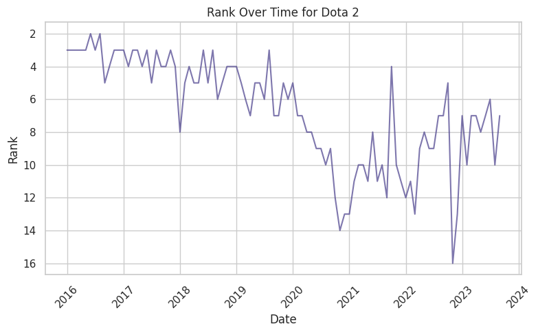
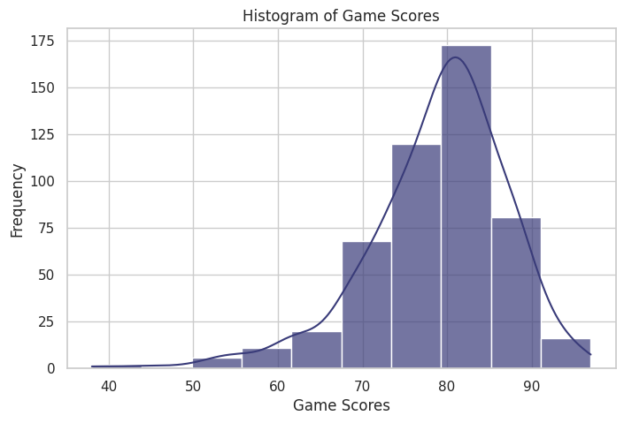
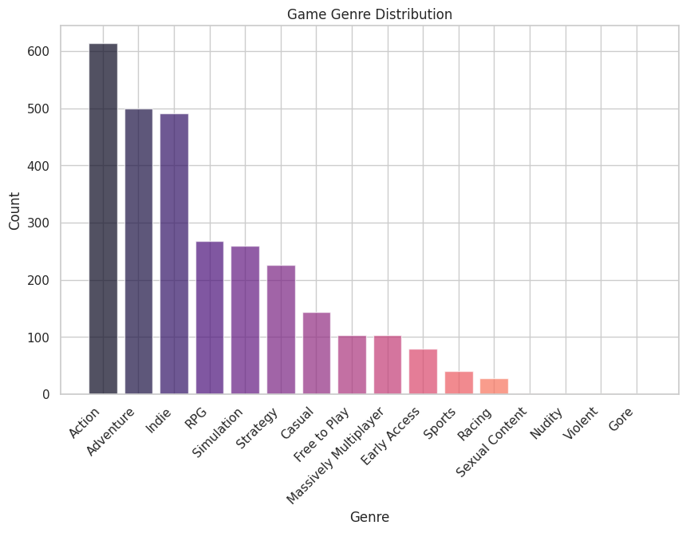
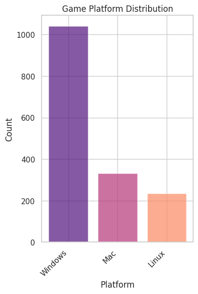
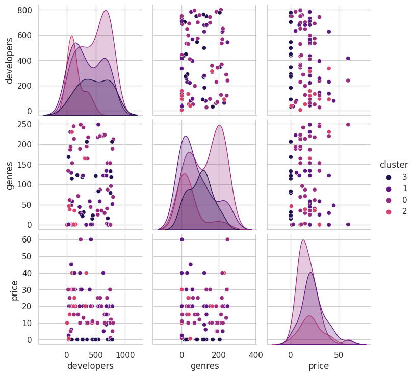
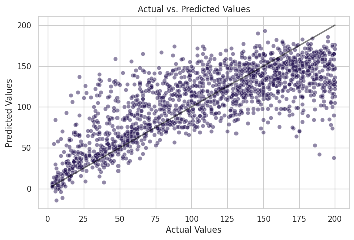
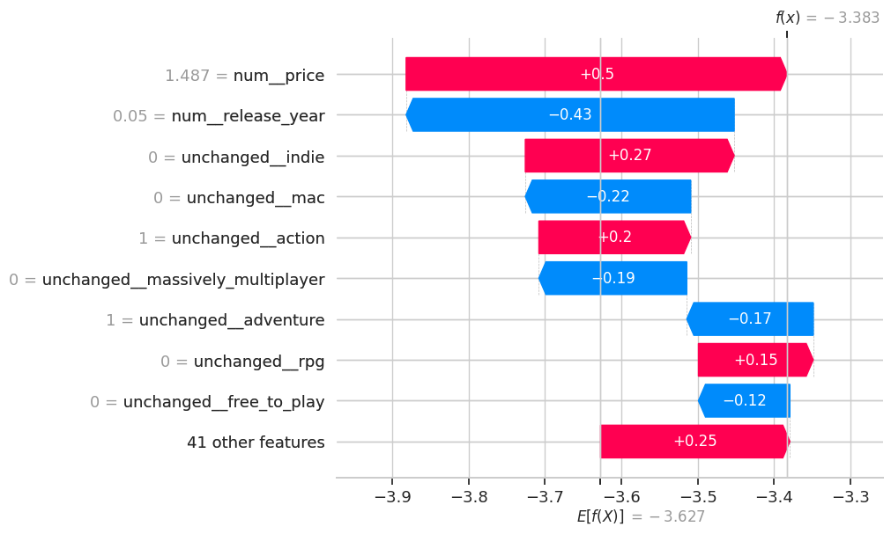
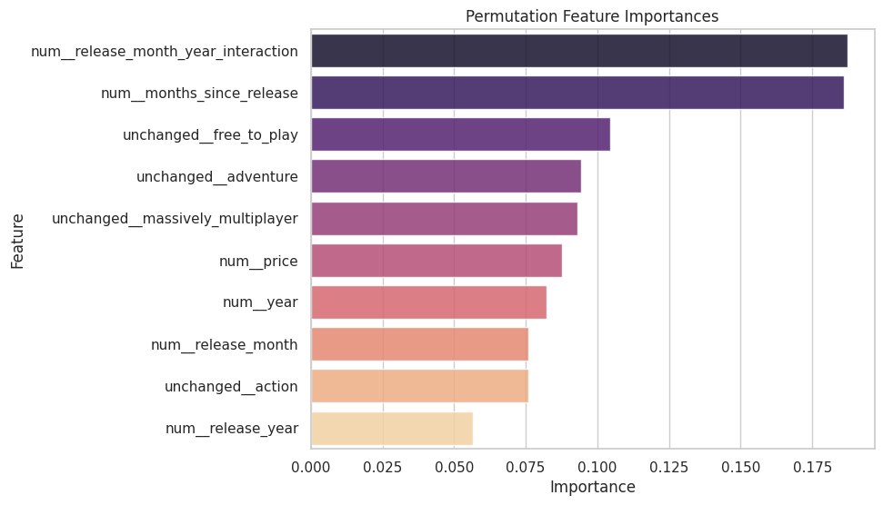

# COMM 599 Final Project
Alison Huang

### Table of Contents
- [Description](#description)
- [Data Sources](#data-sources)
- [Running the Code](#running-the-code)
- [Results](#results)

### Description
The aim of the project is identify key factors that contribute to a game's success on streaming platforms such as Twitch. I am interested in knowing how to predict if a given game will be successful on Twitch through the use of predictive modeling.

I ended up with two models, a classifier and a regressor. The classifier predicts if the game will be in the top 200 streamed games on Twitch in a given monthly period. If the classifier says it will be in the top 200, the regressors predicts the specific ranking in the top 200.

My MVP was to build a predictive model, which I achieved. My goals were 1) to create an interactive site where users can input their own data about a game and see the predicted results and 2) to create a Tableau dashboard to visualize the predicted results. However, because of time and hosting (money) constraints, I was unable to completely reach my goals for the project.

All data files can be found within the "datasets" directory. All models can be found within the "models" directory.

### Data Sources
1. [Twitch Kaggle Dataset](https://www.kaggle.com/datasets/rankirsh/evolution-of-top-games-on-twitch)
This is a dataset that contains data on the top 200 streamed game categories on Steam for every month from January 2016 to September 2023, which is 93 months.
2. [Steam API](https://steamcommunity.com/dev)
An API provided by Steam that has information on games available on Steam. I used this API to get game information to align with the Twitch dataset. *Sample queries: [All Apps](http://api.steampowered.com/ISteamApps/GetAppList/v0002?format=json), [Game Details](https://store.steampowered.com/api/appdetails?appids=322330&cc=US&l=en), [Game Reviews](https://store.steampowered.com/appreviews/322330?json=1&filter=all)*

### Running the Code
There are three main notebook files. The notebooks should be run in the order they are listed.  
There is also an archived notebook file, "archived_game_reviews.ipynb".

1. **data_collection.ipynb**:  
Used the Kaggle Twitch dataset to create a games dataset with game information scraped from Steam and create a cleaned Twitch dataset. The two datasets are saved to the datasets/ directory.

2. **exploratory_data_analysis.ipynb**:  
Preliminary visualizations to better understand the Twitch dataset and the games dataset. Looked at the distribution of genres/platforms, the most watched Twitch game categories, etc. Also conducted exploratory analysis via clustering.

3. **predictive_modeling.ipynb**:  
Preprocessed the two datasets into one dataset, then built two models, a classifier and a regressor. Used Bayesian Optimization for hyperparameter tuning. Tested the models on hypothetical game data to demonstrate how it can be used to predict results for games released in the future. The two models are saved to the models/ directory.

4. **archived_game_reviews.ipynb**:  
Contains code on game reviews, which is not used in the project anymore. Scraped game reviews for games in the games dataset, graphed visualizations for game reviews data, and conducted linear regression analysis.

### Results
The classifier uses the HistGradientBoostingClassifier model and has a ROC-AUC of around 0.96.
The regressor uses the HistGradientBoostingRegressor model and has a RMSE of around 35.85 (on a scale of 1 to 200).

Below are some visualizations from the exploratory data analysis and the modeling stages.

**Exploratory Data Analysis**

**Predictive Modeling & Performance Evaluation**

